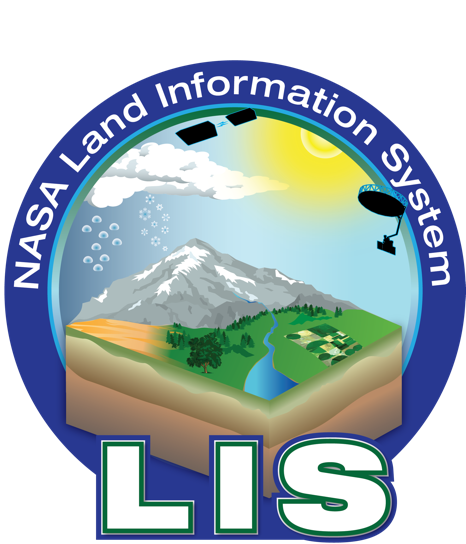

# LIS Boot Camp

This repository contains a collection of information to help orient new users of NASA's Land Information System (LIS).

## Table of Contents
* [Glossary of Terms and Concepts](<!-- insert link -->)
*
