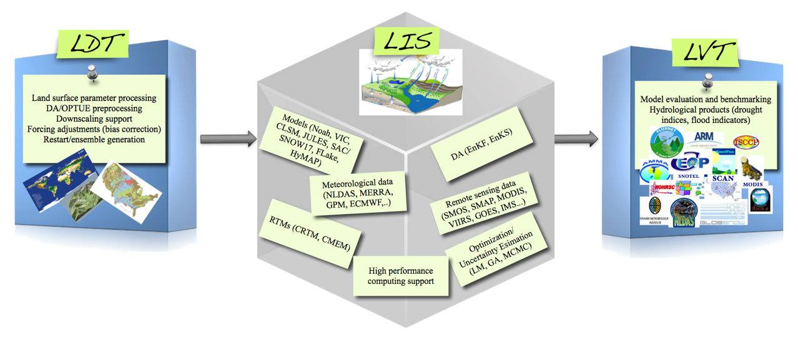

# LIS Boot Camp

This repository contains a collection of information to orient new users of NASA's Land Information System (LIS).

## Table of Contents

* [Introduction to LIS](#overview-of-nasa's-land-information-system)
* [Glossary of Terms and Concepts](LIS-glossary.md)
* [LIS on NCCS Discover](LIS-on-NCCS-discover.md)
* [Helpful Links](#helpful-links)

-----

## Overview of NASA's Land Information System

NASA's Land Information System (LIS) is a software framework for high performance terrestrial hydrology modeling and data assimilation developed with the goal of integrating satellite and ground-based observational data products and advanced modeling techniques to produce optimal fields of land surface states and fluxes. LIS is used to study land surface processes and land-atmosphere interactions, using "best available observations" to force and constrain the models. LIS also enables a number of applications including:

* weather and climate model initialization
* water resources management
* natural hazards management

The LIS framework is comprised of three components:

* **Land Information System (LIS)** - the modeling and data assimilation framework
* **Land Data Toolkit (LDT)** - supports the data preprocessing needs for LIS (e.g., parameter data processing, data assimilation support, forcing bias correction)
* **Land Verification Toolkit (LVT)** - environment for model benchmarking and evaluation

-----

## Key Publications
<!-- add links -->
* [Kumar et al. (2006): Land Information System: An interoperable Framework for High Resolution Land Surface Modeling, Environmental Modeling and Software, Vol 21, pp 1402-1415.](http://prhouser.com/houser_files/Kumar2006.pdf)

* [Peter-Lidard et al. (2007): High-performance earth system modeling with NASA/GSFC’s Land Information System, Innovations in Systems and Software Engineering, 3(3),157—165.](http://prhouser.com/houser_files/LIS2007.pdf)

-----

## Helpful Links

* [LIS Homepage](https://lis.gsfc.nasa.gov/)
* [LIS GitHub Page](https://github.com/NASA-LIS)
    * This is where the LIS source code lives
* [NASA's Modeling Guru Forum](https://modelingguru.nasa.gov/community/atmospheric/lis)
    * Need help with LIS? Search the forum or ask for help!
* New to Git/GitHub?
    * [Intro to Git](https://git-scm.com/book/en/v2)
    * GitHub
        * [Text Guide](https://help.github.com/en/github)
        * [Video Guide](https://www.youtube.com/playlist?list=PLg7s6cbtAD15G8lNyoaYDuKZSKyJrgwB-)
    * [How the LIS team works with GitHub](https://github.com/NASA-LIS/LISF/blob/master/docs/working_with_github/working_with_github.adoc)
* LIS Documentation
    * [LIS Documentation](https://lis.gsfc.nasa.gov/documentation/lis)
    * [LDT Documentation](https://lis.gsfc.nasa.gov/documentation/ldt)
    * [LVT Documentation](https://lis.gsfc.nasa.gov/documentation/lvt)
